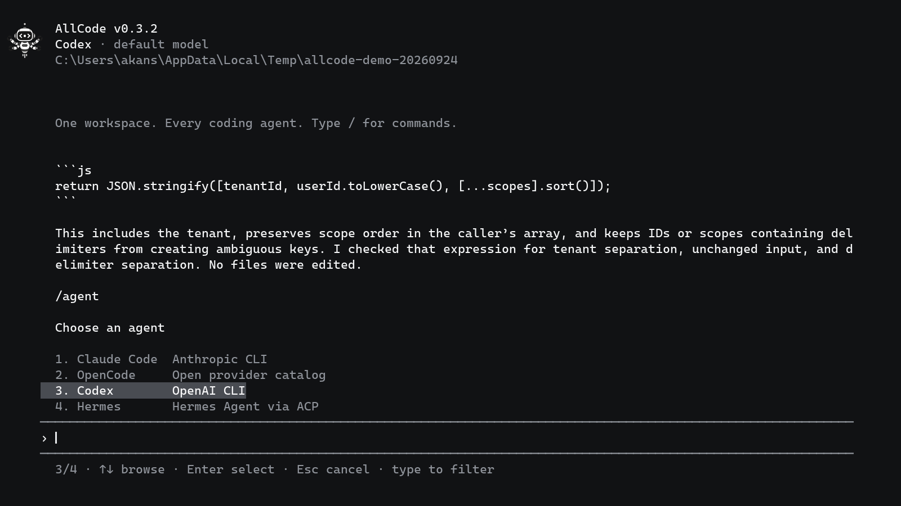

<p align="center">
  
</p>

<h1 align="center">AllCode</h1>

<p align="center">One terminal workspace for the coding agents you already use.</p>

<p align="center">
  <a href="https://github.com/itsramananshul/allcode/actions/workflows/ci.yml"></a>
  <a href="LICENSE"></a>
  
</p>

AllCode lets you start a task with one coding agent and continue it with another. The active agent does the work through its own installed CLI; AllCode carries the conversation across the switch. Claude Code, OpenCode, Codex, and Hermes are built in. You can add other installed agents, including one-shot CLIs, with an adapter.

[](docs/demo/allcode-terminal-demo.mp4)

[Watch the terminal session](docs/demo/allcode-terminal-demo.mp4) — a real AllCode run, with waiting time shortened. It shows a task moving from Codex to Claude Code and the tests passing after the fix.

## Install

You need Node.js 22 or newer and at least one installed coding agent. Set up that agent's CLI and account first; AllCode uses its existing authentication.

```bash
git clone https://github.com/itsramananshul/allcode.git
cd allcode
npm install
npm link
```

Or install the package from the [latest release](https://github.com/itsramananshul/allcode/releases).

From the directory you want to work in, run:

```bash
allcode
```

## Get started

Write a request and press Enter. Type `/` to browse commands; use the arrow keys and Enter to select one.

```text
Find why the authentication test fails and fix it.
/agent
Review the fix with the agent I selected.
```

`/agent` opens the agent picker. `/model` opens the model picker for the active agent, and `/models` lets you select from all discovered models. Your conversation remains available when you switch agents. The model catalog and available permission modes depend on the selected agent's CLI and account.

Use `/mode` to choose a permission mode and `/effort` to choose reasoning effort where the agent supports it. In approval modes, AllCode shows a request before the action and lets you allow or deny it. Press Esc or Ctrl+C to interrupt a running task.

To add an installed agent, use `/add` → Agent. AllCode looks for agent commands on your PATH and can ask the active coding agent to write the adapter. Review the generated adapter before you install it. If an earlier adapter draft exists, AllCode reuses it instead of discarding the work. Adapters live outside the package so updates do not replace them. A custom CLI can expose only the capabilities it actually supports; AllCode shows any gaps.

For details, see [getting started](docs/getting-started.md), [agents and models](docs/agents-and-models.md), and the [command reference](docs/commands.md).

## More

- [Security and approvals](docs/security.md)
- [Troubleshooting](docs/troubleshooting.md)
- [Architecture](docs/architecture.md)
- [Contributing](CONTRIBUTING.md)

To build and test locally, run `npm run check`. AllCode is released under the [MIT license](LICENSE); redistributions and forks must retain the copyright and license notice.
