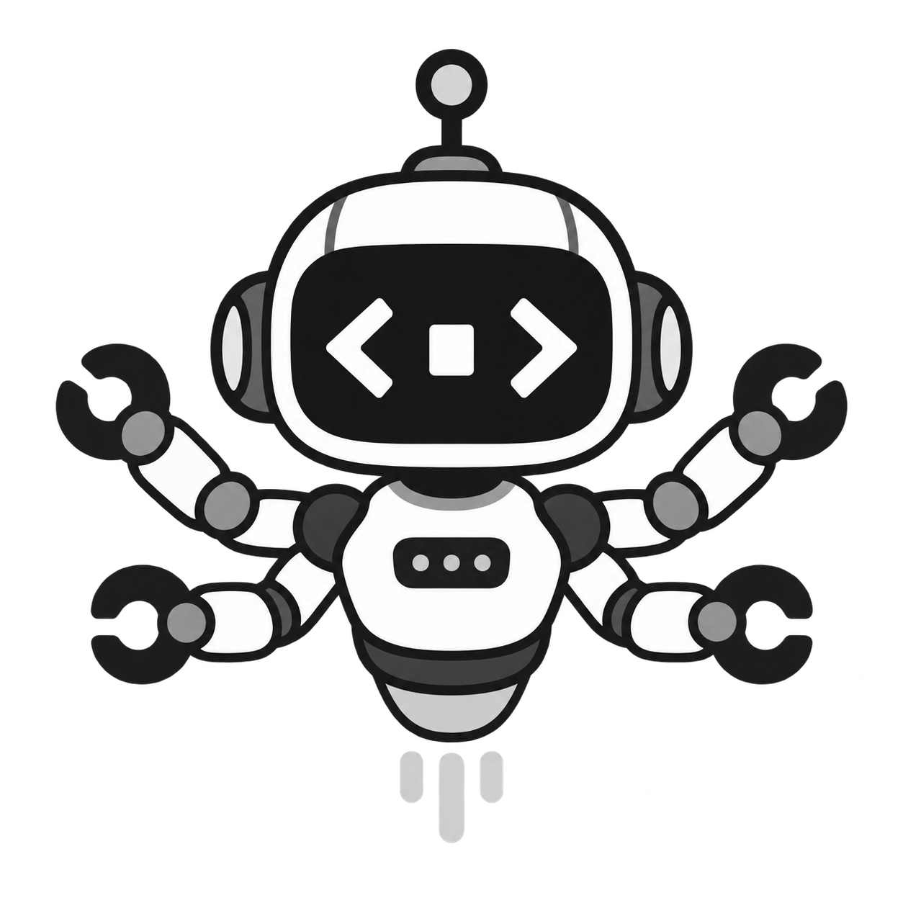

<p align="center">
  
</p>

<h1 align="center">All Code</h1>

<p align="center">Claude Code, OpenCode, and Codex in one terminal.</p>

<p align="center">
  <a href="https://github.com/itsramananshul/allcode/actions/workflows/ci.yml"></a>
  <a href="LICENSE"></a>
  
</p>

All Code keeps one conversation while you move between coding agents. Start a task in OpenCode, switch to Claude Code, send a review to Codex, and continue without rebuilding the context by hand.

Each agent runs through its installed CLI. The models, account, tools, configuration, and permissions attached to that CLI stay available.

## Install

All Code requires Node.js 22 or newer and at least one supported agent:

- [Claude Code](https://github.com/anthropics/claude-code)
- [OpenCode](https://github.com/anomalyco/opencode)
- [Codex](https://github.com/openai/codex)

```bash
git clone https://github.com/itsramananshul/allcode.git
cd allcode
npm install
npm link
```

Run it from a project directory:

```bash
cd path/to/project
allcode
```

## Use

Type a request as usual. All Code sends it to the active agent.

```text
› find the cause of the failing authentication test
```

Change agents without leaving the session:

```text
› /agent codex
› review the current diff

› /agent claude
› apply the review and run the tests
```

Choose a model from the active agent:

```text
› /model
› /model opencode/big-pickle
```

List models from OpenCode and Codex alongside All Code's Claude aliases:

```bash
allcode models
```

All Code remembers the selected agent, one model per agent, native session IDs, and the shared conversation in `.allcode/session.json`.

## Agents

| Agent | Route | Model source |
| --- | --- | --- |
| Claude Code | `claude` | Claude account aliases and model IDs |
| OpenCode | `opencode` | `opencode models`, including configured providers and the OpenCode Go catalog |
| Codex | `codex` | Codex app-server model catalog |

Check the local installation:

```bash
allcode agents
```

All Code also gives the active agent an MCP broker. It can delegate a task to either of the other agents, wait for the result, and incorporate that result into the current job.

## Commands

| Command | Action |
| --- | --- |
| `/agent` | Open the agent picker |
| `/agent <name>` | Switch to Claude Code, OpenCode, or Codex |
| `/model` | Open the model picker for the active agent |
| `/model <id>` | Select an exact model ID |
| `/models` | Show all discovered model catalogs |
| `/status` | Show the current route and session |
| `/clear` | Redraw the All Code workspace |
| `/help` | Show commands |
| `/exit` | Exit All Code |

Shell commands and configuration are covered in the [command reference](docs/commands.md).

## Documentation

- [Getting started](docs/getting-started.md)
- [Command reference](docs/commands.md)
- [Agents and models](docs/agents-and-models.md)
- [Architecture](docs/architecture.md)
- [Security](docs/security.md)
- [Troubleshooting](docs/troubleshooting.md)
- [Contributing](CONTRIBUTING.md)

## Development

```bash
npm install
npm run check
```

The test matrix runs on Windows, macOS, and Linux with Node.js 22 and 24.

## License

[MIT](LICENSE)
