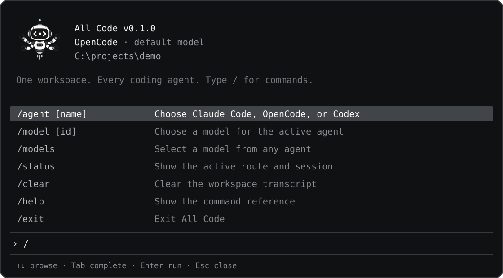
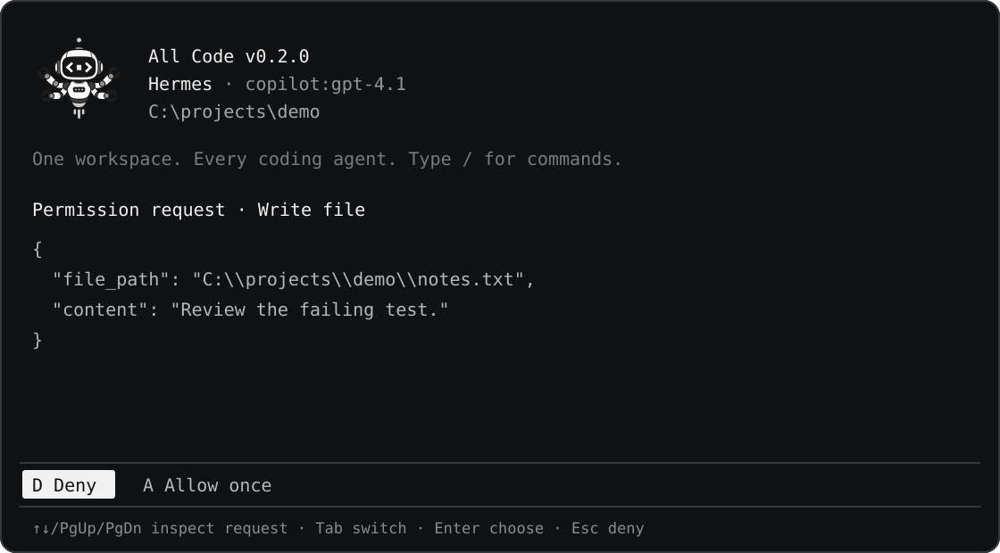

# Command reference

## Workspace

```text
allcode [--agent claude|opencode|codex|hermes] [--cwd PATH]
```

`--agent` selects the initial route. `--cwd` opens another working directory.

## Slash commands

Typing `/` opens the command palette immediately. Continue typing to filter it, move with the up and down arrow keys, press Enter to run the highlighted command, or press Tab to complete it in the input. Escape dismisses the palette.



| Command | Description |
| --- | --- |
| `/agent` | Open the agent picker |
| `/agent claude` | Switch to Claude Code |
| `/agent opencode` | Switch to OpenCode |
| `/agent codex` | Switch to Codex |
| `/agent hermes` | Switch to Hermes |
| `/add` | Choose Agent or Skill |
| `/add agent` | Scan installed agent commands, build a reviewed adapter, or register an ACP/one-shot CLI |
| `/add skill` | Copy a reviewed `SKILL.md` folder into supported agents' skill directories |
| `/provider` | Alias for `/agent` |
| `/model` | Open the model picker |
| `/model <id>` | Select a native model ID |
| `/models` | Browse and select models from all installed agents; selecting one switches the active agent |
| `/effort` | Choose a reasoning level supported by the active model |
| `/mode` | Choose the active agent's permission mode; `/permissions` is an alias |
| `/status` | Print the active agent, model, effort, permission mode, session ID, and state file |
| `/clear` | Clear the workspace transcript |
| `/help` | Print the command list |
| `/exit` | Exit; `/quit` is an alias |

Input that does not match an All Code command is sent to the active agent as a prompt. Agent-specific interactive slash commands are not added to the All Code palette; use `allcode native --agent <name>` when you need that agent's own terminal commands.

`/agent`, `/add`, `/model`, `/models`, `/effort`, and `/mode` open searchable pickers. Their lists support arrow-key navigation, Enter or Tab to select, and Escape to keep the current value.

`/effort` reads OpenCode variants and Codex-supported reasoning levels for the current model. Claude Code offers its CLI effort levels. Selecting another model resets that agent's effort to its default.

`/mode` shows provider-specific controls:

| Agent | Modes |
| --- | --- |
| Claude Code | Manual, Accept edits, Auto, Don't ask, Plan, Bypass permissions |
| OpenCode | Native rules, Ask, Auto-approve, Deny tools |
| Codex | Read-only, Workspace write, Untrusted commands, No prompts, Full access |
| Hermes | Ask before edits, Accept workspace edits, Don't ask for edits |

When a provider asks for permission, the proposed command, tool input, or file change appears in a scrollable All Code prompt. Deny is selected by default. Use the arrow keys or Page Up/Down to inspect, Tab to switch between Deny and Allow once, then Enter to decide. `A` allows once, `D` or Escape denies. Bypass/auto-approve modes require a separate confirmation when selected. Provider and organization policies can still deny an action.



Approval prompts are part of the interactive `allcode` workspace. One-shot `allcode run` calls and background delegated tasks do not display this prompt; see [Security](security.md#agent-permissions).

## Inspect agents

```bash
allcode agents
```

Prints the availability and resolved executable for Claude Code, OpenCode, Codex, Hermes, and registered agents.

## Add an agent or skill

Type `/add` in the workspace to choose Agent or Skill. The agent picker scans commands on PATH. Choose a detected CLI to ask the active agent to inspect it and write a draft in the workspace; if the CLI is not listed, search by its command name or choose advanced manual setup. Review the draft's code, then confirm installation. The adapter and its registration are saved under `~/.allcode`, separate from the npm package. To install a draft from a shell:

```sh
allcode add agent ./path/to/adapter-draft
```

The draft needs `adapter.json` and `agent.mjs`; see the [adapter-authoring skill](../skills/allcode-agent-adapter/SKILL.md). All Code requires confirmation before installing executable adapter code. You can also register a basic route directly:

```bash
allcode add agent myagent --protocol acp --command /absolute/path/to/myagent --arg acp
allcode add agent mycli --protocol oneshot --command /absolute/path/to/mycli --arg run --arg --plain
```

The command must already be installed. Launch arguments are passed directly, without a shell. For one-shot CLIs, All Code sends the prompt on stdin unless an argument contains `{prompt}`. Add `--model MODEL_ID` for each model you want listed; include `{model}` in an argument if selecting that model should reach the CLI. One-shot output is read as plain text from stdout. It has no native session resume, model discovery, or All Code approval callback. ACP agents supply those capabilities through their own server. If the CLI reads `SKILL.md` files, pass each verified global directory with `--skill-dir PATH`; skill installation will include it. Registrations are stored in `~/.allcode/agents.json` and appear in `/agent`, `/models`, `allcode agents`, and delegation.

Install a skill from a local folder or a GitHub repository whose root contains `SKILL.md` (use `#path/to/skill` for a subdirectory):

```bash
allcode add skill ./my-skill
allcode add skill https://github.com/owner/repo#skills/my-skill
```

All Code shows the skill name and destinations, then asks before copying. In a non-interactive shell, pass `--yes` after reviewing the source. Existing same-name folders are skipped, never overwritten. GitHub skill sources are cloned for inspection; agent executables are not downloaded automatically. See [Adding agents and skills](agents-and-models.md#adding-agents-and-skills) for the destination rules.

## Inspect models

```bash
allcode models
allcode models claude
allcode models opencode
allcode models codex
allcode models hermes
```

## Run one task

```text
allcode run <agent> [--cwd PATH] [--model ID] [--session ID] <prompt>
```

Examples:

```bash
allcode run opencode --model opencode/big-pickle "find the failing test"
allcode run codex "review the current diff"
allcode run claude "explain the parser architecture"
allcode run hermes --model copilot:gpt-4.1 "explain the parser architecture"
```

The command prints the native session ID and final response as JSON.

## Native interface

```bash
allcode native --agent opencode
```

Native mode embeds the selected agent's own terminal interface. Use the default `allcode` command for the shared All Code interface and persisted cross-agent conversation.

## MCP server

```bash
allcode mcp
```

Starts the All Code MCP server over standard input and output. Agent adapters configure this automatically.

The server exposes:

- `list_agents`
- `start_task`
- `task_status`
- `list_tasks`
- `cancel_task`

## Environment

| Variable | Description |
| --- | --- |
| `ALL_CODE_ALLOWED_ROOTS` | Directories available to delegated tasks, separated by the operating system path delimiter |
| `ALL_CODE_MAX_DEPTH` | Maximum delegation depth; default `3` |
| `ALL_CODE_CLAUDE_COMMAND` | Absolute path to the Claude Code executable |
| `ALL_CODE_OPENCODE_COMMAND` | Absolute path to the OpenCode executable |
| `ALL_CODE_CODEX_COMMAND` | Absolute path to the Codex executable |
| `ALL_CODE_HERMES_COMMAND` | Absolute path to the Hermes executable |
| `ALL_CODE_AGENT_REGISTRY` | Override the custom-agent registry path (advanced use and tests) |

`ALL_CODE_DEPTH` and `ALL_CODE_HOST` are set internally for delegated processes.
