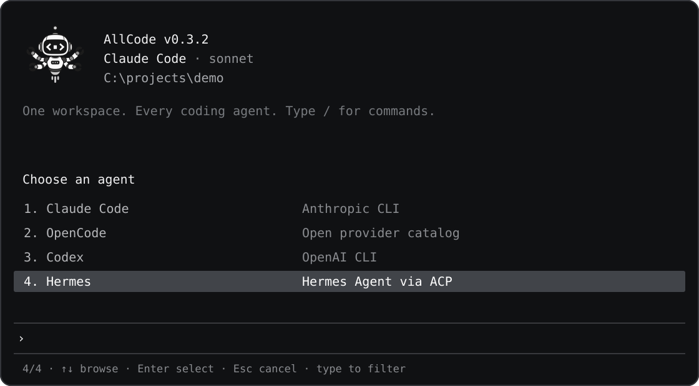
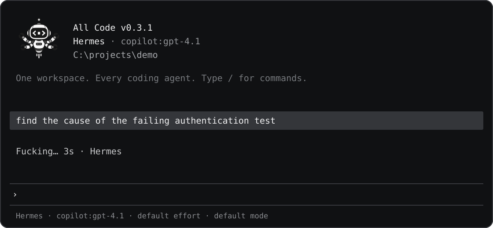
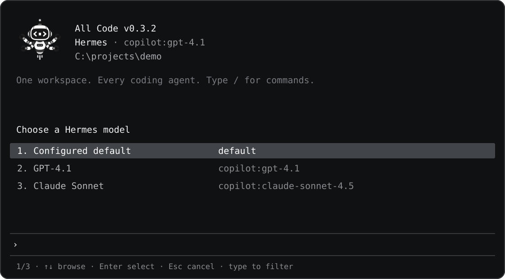

# Getting started

## Before you install

Install Node.js 22 or newer and one or more of the supported coding agents:

- [Claude Code](https://github.com/anthropics/claude-code)
- [OpenCode](https://github.com/anomalyco/opencode)
- [Codex](https://github.com/openai/codex)
- [Hermes Agent](https://github.com/NousResearch/hermes-agent)

Sign in through each agent's own CLI. All Code uses those existing sessions.

## Install All Code

```bash
git clone https://github.com/itsramananshul/allcode.git
cd allcode
npm install
npm link
```

The [v0.3.0 release](https://github.com/itsramananshul/allcode/releases/tag/v0.3.0) also includes an installable npm tarball. Download it, then run `npm install -g ./allcode-0.3.0.tgz`. This installs the `allcode` command; each coding agent still needs its own installation and login.

Confirm that All Code can find the agents:

```bash
allcode agents
```

Each entry reports the executable path or the reason it could not be resolved.

## Open a workspace

Run All Code from the repository you want to work on:

```bash
cd path/to/project
allcode
```

Open with a specific agent:

```bash
allcode --agent claude
allcode --agent opencode
allcode --agent codex
allcode --agent hermes
```

Without `--agent`, an existing workspace resumes its last active agent. A new workspace starts with OpenCode.

## Start a task

Enter a request at the prompt:

```text
› trace the request path for POST /api/login and explain the failure
```

Type `/` at an empty prompt to browse every All Code command without leaving the workspace.


The menu filters as you type. Use ↑ and ↓ to highlight a command, Enter to run it, Tab to complete its name, or Escape to close the menu. At a regular prompt, ↑ and ↓ browse your input history.

Switch agents at any point:

```text
› /agent codex
› review the proposed fix before it is applied
```

`/agent` opens an arrow-key picker like `/model`. You can type to filter it or use `/agent codex` to switch directly. The next agent receives the shared conversation and continues in the same working directory.



Your submitted input appears on a highlighted line without a `You` prefix. Agent replies appear in a separate block labeled with the agent's name and elapsed time.

While a task runs, a changing status word shows elapsed time and the active agent. The response appears beneath it when the task completes. Windows Terminal displays the full mascot image in the header.



## Select a model

```text
› /model
```

The picker reads the active agent's catalog. You can also enter an exact native model ID:

```text
› /model opencode/big-pickle
```

All Code saves one model selection per agent.

For Hermes, `/model` reads the model catalog from your installed Hermes ACP service. The `default` entry uses Hermes's configured model. If that provider reports an unavailable model, choose another model from the picker; All Code does not rewrite your Hermes configuration.

Use `/models` to browse models from all installed agents. Select with the arrow keys and Enter; All Code switches to the model's agent automatically. The picker scrolls through the full list, and typing filters it—you never need to enter the full model ID.



Use `/effort` to choose one of the selected model's reasoning levels. Use `/mode` to set that agent's permission mode. If the chosen mode asks and an action requires your decision, All Code pauses and shows an approve/deny prompt. Deny is selected initially; press Tab to select Allow once, then Enter, or press `A` to allow immediately. Press `D` or Escape to deny. The permission mode and effort are shown by `/status` and saved per agent.

To connect another installed coding CLI or add a shared `SKILL.md` skill, type `/add`. Choose Agent or Skill, then follow the prompts. The Agent picker scans for installed commands; choose one to generate an adapter draft, then inspect it before installing. If it isn't listed, search by command name or use advanced manual setup. ACP and one-shot routes remain available. [Agent and skill setup](agents-and-models.md#adding-agents-and-skills) explains the capabilities and install locations.


See the [permission modes](commands.md#slash-commands) for each agent and the [security guide](security.md) before using an auto-approve or bypass mode.

## Session files

Workspace state is stored in:

```text
.allcode/session.json
```

Add `.allcode/` to the project's ignore file. Removing the directory starts a fresh All Code session without signing out any agent.

Continue with the [command reference](commands.md) or read [Agents and models](agents-and-models.md).
